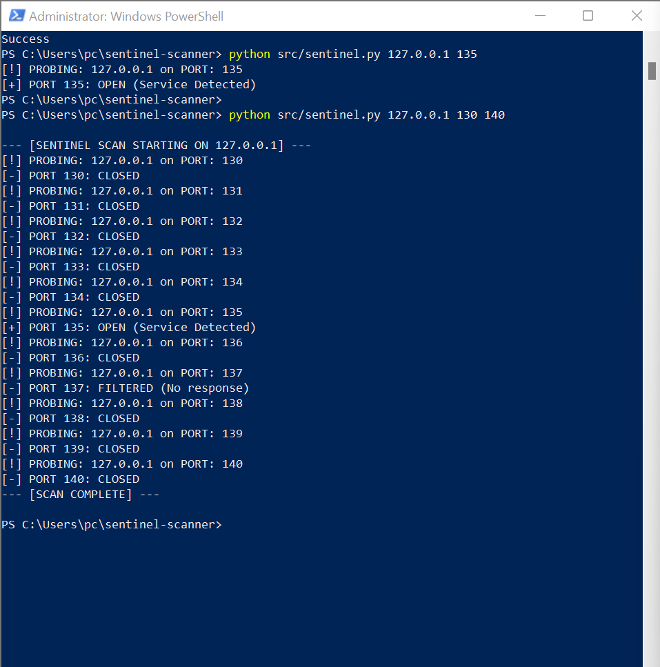

# 🛰️ Project Sentinel: Stealth TCP SYN Scanner

Project Specifications
System Language: Python 3.12+

Core Engine: Scapy (Packet Manipulation Library)
Primary Focus: Network Security & Protocol Analysis
Operational Status: 🟢 Active / Lab Testing Phase
Network Layer: Layer 4 (Transport Layer)

---

### Overview
**Sentinel** is a custom-built network reconnaissance tool designed for **Security Engineers** and **Network Analysts**. Unlike a standard TCP connect scan, Sentinel performs a **Half-Open (SYN) Scan**. This technique allows for service discovery without completing the full TCP three-way handshake, reducing the log footprint on the target system.

### Technical Methodology (The Theory)
This tool operates at the **Transport Layer (Layer 4)** of the OSI Model by manipulating TCP flags. 


**The Logic Flow:**
1.  **SYN Packet:** Sentinel crafts a raw IP/TCP packet with the `SYN` flag set and sends it to a specific port.
2.  **State Analysis:**
    * **SYN-ACK (0x12):** The port is **OPEN**. The target is ready to establish a connection.
    * **RST-ACK (0x14):** The port is **CLOSED**. The target actively refused the connection.
    * **No Response:** The port is **FILTERED**. A firewall or IDS is likely dropping the packets.
3.  **Graceful Termination:** If a port is found open, Sentinel immediately sends a `RST` (Reset) packet to tear down the connection before it becomes "Established."

### Features
- **Raw Packet Crafting:** Utilizes the `Scapy` library for low-level network interaction.
- **Port Range Scanning:** Supports sequential probing of multiple ports in a single execution.
- **Automated Service Identification:** Detects common open ports like **RPC (135)**, **SMB (445)**, and **HTTP (80)**.
- **NoneType Safety:** Robust error handling for network timeouts and unresponsive hosts.

### Demonstration

*Above: Sentinel performing a stealth scan on the local loopback interface (127.0.0.1) identifying active Windows services.*

### Installation & Usage
> **Note:** Raw packet crafting requires Administrator/Root privileges.

```bash
# Clone the repository
git clone [https://github.com/YOUR_USERNAME/sentinel-scanner.git](https://github.com/YOUR_USERNAME/sentinel-scanner.git)
cd sentinel-scanner

# Install dependencies
pip install -r requirements.txt

# Execute a range scan (Target IP, Start Port, End Port)
# Example: Scanning ports 130 to 140 on local machine
python src/sentinel.py 127.0.0.1 130 140
